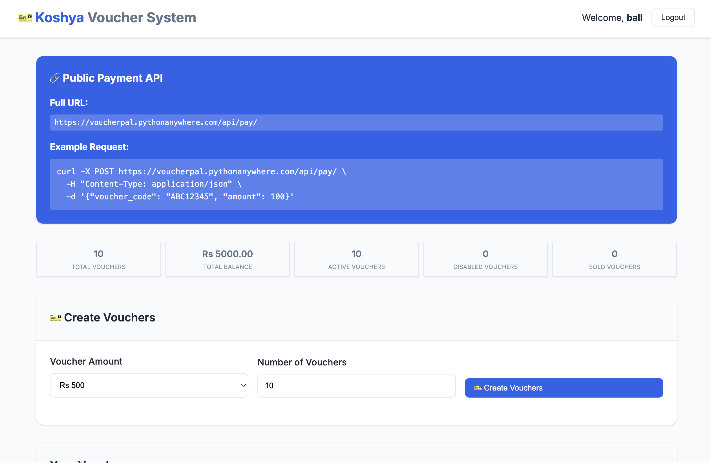
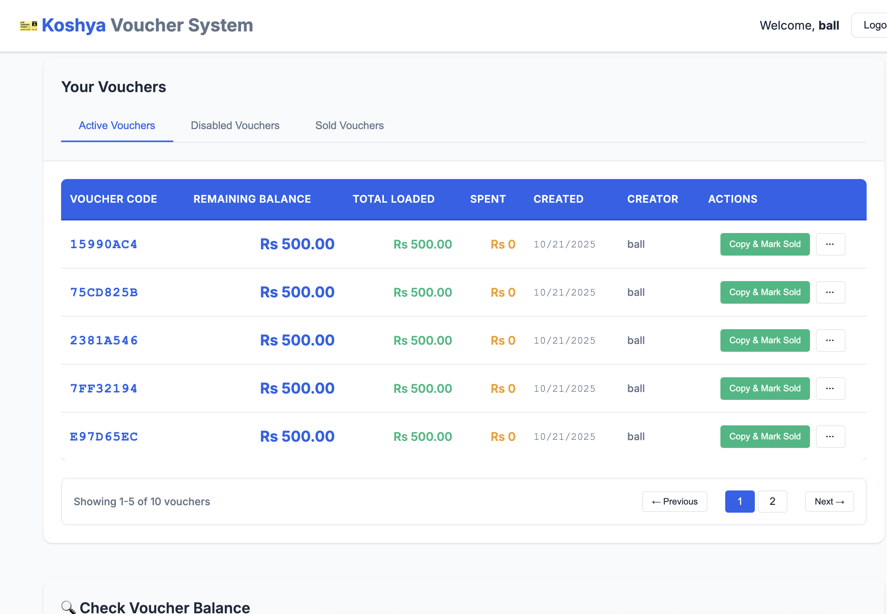
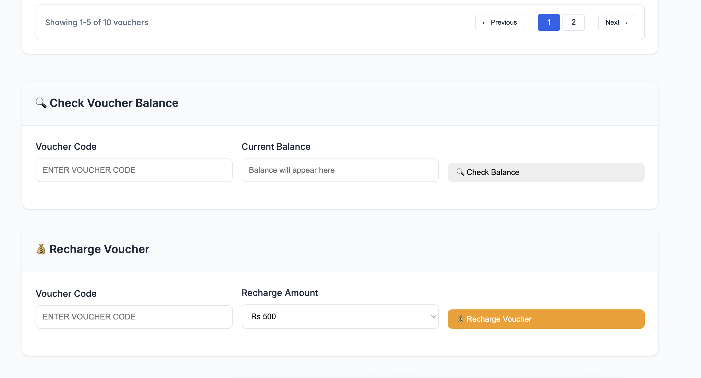

# 🎫 Koshya Voucher System

An indie developer-friendly voucher system for charging small, irregular amounts in Nepal. Perfect for web and mobile developers who want to monetize their tools and services with flexible, usage-based payments.

## 🌐 Live Demo

**🚀 [Try the live application](https://voucherpal.pythonanywhere.com/)**


## 📸 Dashboard Screenshots

### Main Dashboard Interface

*Complete voucher management dashboard with statistics, voucher creation, and management tools*

### Voucher Management

*Active, disabled, and sold voucher management with bulk operations*

### Payment Processing

* interface with real-time balance checking*

## 🎯 The Problem We Solve

### Current Payment Challenges in Nepal

**There are no easy ways to make small, irregular online payments and tracking in Nepal.**

Traditional solutions have significant limitations:

1. **Subscription-based systems** - Users pay either too much or too little for their actual consumption
2. **Payment vendors like eSewa, Khalti** - Have very stringent and expensive API access requirements
3. **Complex integration** - Difficult setup and maintenance for small developers

### 🚀 Our Solution

**Koshya Voucher System is a step towards solving both problems at once.** Although it has its flaws, it can greatly make it easier to charge for your tools and technologies that you build online.

## 👥 Target Users

**Web and mobile developers and small app/website owners** who want to charge small irregular amounts to their users:

- **AI Tools**: Charge per AI photo generation, text processing, or analysis
- **Content Access**: Pay-per-article reading, premium content access
- **API Usage**: Metered API calls, usage-based billing
- **Digital Services**: One-time tool usage, temporary access

### 💡 Real-World Example

**If your app has a feature like AI photo maker, you need to track usage.** This system provides an easy way to do it:

1. **User pays you** via WhatsApp/messenger or other chat methods
2. **You provide voucher code** with equivalent balance
3. **User uses your app** - API deducts balance as they consume
4. **Track everything** - Complete usage analytics and payment history

## 🏗️ System Design Philosophy

### Why Manual Selling?

**The system is designed for manual payment collection:**

- **Collect payments yourself** through WhatsApp/messenger or other chat forms
- **Provide voucher codes** with equivalent balance
- **Use API service** to deduct balance as users consume your app
- **Maintain control** over payment flow and customer relationships

### Design Decisions

- **Bulk operations** are only available for creating vouchers (not other operations)
- **Vouchers cannot be deleted** - they can only be disabled for audit trail
- **Manual payment collection** keeps integration simple and flexible
- **Public APIs** for easy integration with any application

## 🛠️ Developer Integration Guide

### 🌐 Public APIs (No Authentication Required)

#### Check Voucher Balance
```bash
# Check any voucher balance - no login required!
curl https://voucherpal.pythonanywhere.com/api/vouchers/ABC12345/balance/
```

**Response:**
```json
{
    "voucher_code": "ABC12345",
    "balance": 500.00,
    "status": "active",
    "message": "Voucher is active and ready for use"
}
```

#### Process Payment
```bash
# Deduct balance when user consumes your service
curl -X POST https://voucherpal.pythonanywhere.com/api/pay/ \
  -H "Content-Type: application/json" \
  -d '{"voucher_code": "ABC12345", "amount": 50.00}'
```

**Response:**
```json
{
    "message": "Payment of Rs 50.00 successful",
    "voucher_code": "ABC12345",
    "remaining_balance": 450.00,
    "transaction_id": 123
}
```

### 🔧 Integration Examples

#### JavaScript Integration
```javascript
// Check if user has sufficient balance
async function checkBalance(voucherCode) {
    const response = await fetch(`https://voucherpal.pythonanywhere.com/api/vouchers/${voucherCode}/balance/`);
    const data = await response.json();
    return data.balance;
}

// Process payment when user uses your service
async function processPayment(voucherCode, amount) {
    const response = await fetch('https://voucherpal.pythonanywhere.com/api/pay/', {
        method: 'POST',
        headers: {
            'Content-Type': 'application/json',
        },
        body: JSON.stringify({
            voucher_code: voucherCode,
            amount: amount
        })
    });
    return await response.json();
}

// Example usage in your app
const userVoucherCode = "ABC12345";
const serviceCost = 25.00;

// Check balance before providing service
const balance = await checkBalance(userVoucherCode);
if (balance >= serviceCost) {
    // Provide your service
    await provideAIService();
    
    // Deduct payment
    const result = await processPayment(userVoucherCode, serviceCost);
    console.log(`Payment processed. Remaining balance: Rs ${result.remaining_balance}`);
} else {
    alert('Insufficient balance. Please recharge your voucher.');
}
```

#### Python Integration
```python
import requests

def check_balance(voucher_code):
    """Check voucher balance"""
    response = requests.get(f'https://voucherpal.pythonanywhere.com/api/vouchers/{voucher_code}/balance/')
    return response.json()

def process_payment(voucher_code, amount):
    """Process payment for service usage"""
    response = requests.post('https://voucherpal.pythonanywhere.com/api/pay/', 
                           json={'voucher_code': voucher_code, 'amount': amount})
    return response.json()

# Example usage
voucher_code = "ABC12345"
service_cost = 25.00

# Check balance
balance_info = check_balance(voucher_code)
if balance_info['balance'] >= service_cost:
    # Provide your service
    provide_ai_service()
    
    # Process payment
    result = process_payment(voucher_code, service_cost)
    print(f"Payment processed. Remaining balance: Rs {result['remaining_balance']}")
else:
    print("Insufficient balance. Please recharge your voucher.")
```

### 📊 Business Workflow

#### For Service Providers (You)
1. **Create vouchers** with initial balances (Rs 100, 200, 500)
2. **Sell vouchers manually** via WhatsApp, messenger, or other methods
3. **Provide voucher codes** to customers
4. **Track usage** through your application
5. **Monitor analytics** and customer behavior

#### For End Users (Your Customers)
1. **Purchase voucher** from you via chat/messenger
2. **Receive voucher code** with balance
3. **Use your service** - balance automatically deducted
4. **Check remaining balance** anytime
5. **Recharge when needed** by purchasing more vouchers

### 🎯 Use Cases

#### AI Photo Generator
```javascript
// User wants to generate 5 AI photos
const photosRequested = 5;
const costPerPhoto = 10; // Rs 10 per photo
const totalCost = photosRequested * costPerPhoto;

// Check balance
const balance = await checkBalance(userVoucherCode);
if (balance >= totalCost) {
    // Generate photos
    const photos = await generateAIPhotos(photosRequested);
    
    // Process payment
    await processPayment(userVoucherCode, totalCost);
    
    // Return photos to user
    return photos;
}
```

#### Article Reading System
```python
# User wants to read premium article
article_cost = 15.00  # Rs 15 per article

# Check balance
balance_info = check_balance(user_voucher_code)
if balance_info['balance'] >= article_cost:
    # Show article content
    show_premium_article()
    
    # Process payment
    result = process_payment(user_voucher_code, article_cost)
    print(f"Article unlocked. Remaining balance: Rs {result['remaining_balance']}")
```

## 🔧 Admin Management

### Creating Vouchers (Requires Authentication)
```bash
# Get authentication token first
curl -X POST https://voucherpal.pythonanywhere.com/api/get-token/ \
  -H "Content-Type: application/json" \
  -d '{"username": "your_username", "password": "your_password"}'

# Create vouchers (use token from above response)
curl -X POST https://voucherpal.pythonanywhere.com/api/vouchers/ \
  -H "Authorization: Token your_token_here" \
  -H "Content-Type: application/json" \
  -d '{"initial_value": 500, "count": 10}'
```

### Voucher Management
- **View all vouchers** with status (active, disabled, sold)
- **Recharge vouchers** with additional funds
- **Disable/enable vouchers** as needed
- **Track statistics** and usage analytics
- **Monitor transactions** and payment history

## 📞 Support & Contact

**📧 Email Support**: [vouchernepal@proton.me](mailto:vouchernepal@proton.me)

If you encounter any issues, have questions, or need assistance with the voucher system, please don't hesitate to reach out!

## 🚀 Ready to Start?

1. **Try the live demo** at [https://voucherpal.pythonanywhere.com/](https://voucherpal.pythonanywhere.com/)
2. **Create your first vouchers** and start accepting payments
3. **Integrate the APIs** into your application
4. **Start monetizing** your tools and services!

**Koshya Voucher System** - Your complete solution for flexible, usage-based payments in Nepal! 🎫✨